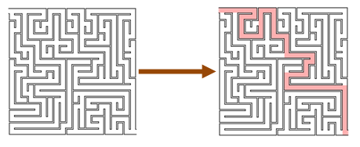

---
# You can also start simply with 'default'
theme: seriph
# random image from a curated Unsplash collection by Anthony
# like them? see https://unsplash.com/collections/94734566/slidev
# background: https://cover.sli.dev
# some information about your slides (markdown enabled)
title: PBT Workshop
info: |
  Un workshop introduttivo a Property-Based Testing
  
# apply unocss classes to the current slide
class: text-center
# https://sli.dev/features/drawing
drawings:
  persist: false
# slide transition: https://sli.dev/guide/animations.html#slide-transitions
transition: slide-left
# enable MDC Syntax: https://sli.dev/features/mdc
mdc: true
# take snapshot for each slide in the overview
overviewSnapshots: true
lineNumbers: true
---

# PBT Workshop

Un workshop introduttivo a Property-Based Testing


---


# Agenda

<div style="zoom:.75;">

> **Teoria** (ma con codice)
>  * Example Based vs Property Based
>  * Esempi di codice (in C#)

<br/>

> **Pratica: Limiti di TDD**
>  * Il Kata sui fattori primi di Robert Martin
>    * In TDD by the book
>    * In PBT

<br/>


> **Teoria**
>  * Theory, Fixture, auto-fixture, generatori, shrinker
>    * Generatori (a manella)
>    * Anatomia di un property test
>    * Catturare proprietà
>    * Enterprise Developer from Hell di Scott Wlaschin

<br/>

> **Pratica: Design Emergente**
>  * Il Print Diamond Kata

<br/>

> **Pratica: caso reale**
>  * Supermarket Kata di Ferdinando Santacroce

</div>

---
layout: section
---

# TDD != Requisiti come codice

---

# Slide di KP

qui

---

# Requisito #1

###  Regola generale
> Il catalogo mostra sempre un elenco di prodotti<br/>
> in ordine alfabetico  


<br/>
<div v-click>

### Esempio concreto

> Per esempio: se il catalogo contiene i prodotti:<br/>
> * Muffin
> * Caffè
> * Latte<br/><br/>
> devono essere mostrati come:<br/><br/>
> * Caffè
> * Latte
> * Muffin

</div>
---

# Requisito #2

###  Regola generale
> Gli account name sono unici e case insensitive

<br/>
<div v-click>

### Esempio concreto
> Per esempio, non si possono avere 2 `john.doe`<br/>
> Inoltre, `john.doe` e `JOHN.DOE` sono lo stesso account.

</div>

---

# Requisito 3

###  Regola generale
> Non applichiamo mai più di una promozione a un acquisto;<br>
>selezioniamo sempre lo sconto più conveniente per il cliente.

<br/>

<div v-click>

### Esempio concreto
> Supponiamo che un cliente acquisti 2 tazze di caffè, 1 latte e 1
muffin per 4 persone.<br/>
> 4 persone hanno diritto alla Promozione "Famiglia", sconto del 20%, 1
EUR.<br/>
> Latte e Muffin attivano la Promozione "Colazione", 0.8 EUR.<br/>
>In questo caso, applichiamo la Promozione "Famiglia", perché è la più conveniente

</div>

---
layout: section
---

# Esempi di traduzione da Example-Based a Property-Based

---


# Un Property Test di esempio: repository

<div v-click="1">

> Quando un prodotto viene salvato<br/>
> può essere ricaricato dal disco tramite il suo ID.

<br/>
</div>

````md magic-move {lines: true}
```csharp
record Product(Guid Id, string Name, Category Category, decimal Price);

[Fact]
void products_can_be_persisted()
{
    var product = new Product(
        Id: Guid.NewGuid(),
        Name: "The Little Schemer", 
        Category: Books, 
        Price: 16.50M);
    
    _repository.Save(product);

    var found = _repository.LoadById(product.Id);

    Assert.Equal(found, product);
}
```

```csharp
record Product(Guid Id, string Name, Category Category, decimal Price);

[Fact]
void products_can_be_persisted()
{
    var product = new Product(
        Id: Guid.NewGuid(),
        Name: "The Little Schemer", 
        Category: Books, 
        Price: 16.50M);
    
    _repository.Save(product);

    var found = _repository.LoadById(product.Id);

    Assert.Equal(found, product);
}
```

```csharp
record Product(Guid Id, string Name, Category Category, decimal Price);

[Property]
bool all_products_can_be_persisted(Product product)
{
    _repository.Save(product);

    var found = _repository.LoadById(product.Id);

    return found == product;
}
```
````

---

# Un Property Test di esempio: Fizz Buzz


<div v-click="1">

> I multipli di 15<br/>
> producono "fizzbuzz"

<br/>
</div>


````md magic-move {lines: true}
```csharp
[Theory]
[InlineData(15)]
[InlineData(30)]
[InlineData(45)]
[InlineData(60)]
void multiples_of_15_return_fizzbuzz(int multipleOf15)
{
    Assert.Equal("fizzbuzz", fizzbuzz(multipleOf15));
}
```

```csharp
[Theory]
[InlineData(15)]
[InlineData(30)]
[InlineData(45)]
[InlineData(60)]
void multiples_of_15_return_fizzbuzz(int multipleOf15)
{
    Assert.Equal("fizzbuzz", fizzbuzz(multipleOf15));
}
```


```csharp {all|2|6|9}
[Property]
Property all_the_multiples_of_15_return_fizzbuzz()
{
    var multiplesOf15 = Arb.From( 
        Arb.Generate<int>()
            .Select(i => i * 15));

    return Prop.ForAll(multiplesOf15, n => 
        fizzbuzz(n) == "fizzbuzz");
}
```
````

---

# Property Test di esempio: account unici e case insensitive

> Gli account name sono unici e case insensitive.<br/>
> Per esempio, non si possono avere 2 `john.doe`.<br/>
> Inoltre, `john.doe` e `JOHN.DOE` sono lo stesso account.<br/>

<br/>

```csharp
internal record Employee(string FirstName, string SecondName);

internal static class AccountNameGenerator
{
    private static string Generate(Employee employee) => ...
}

internal static class AuthenticationSystem
{
    private static bool Login(string accountName) => ...
}
```

---


# Property Test di esempio: account unici

> Gli account name sono unici e case insensitive.<br/>
> Per esempio, non si possono avere 2 `john.doe`.<br/>

<br/>

```csharp
[Property]
bool account_names_are_unique(List<Employee> employees)
{
    var accountNames = employees.Select(AccountNameGenerator.Generate);

    return accountNames.ContainNoDuplicates();
}

bool ContainNoDuplicates(IEnumerable<string> xs) =>
    xs.SequenceEqual(xs.Distinct());
```

---

# Property Test di esempio: account case insensitive

> Gli account name sono unici e case insensitive.<br/>
> Per esempio, non si possono avere 2 `john.doe`.<br/>

<br/>

```csharp
[Property]
bool account_names_are_case_insensitive_(Employee employee)
{
    var accountName = AccountNameGenerator.Generate(employee);

    var upper = accountName.ToUpper();
        
    return AuthenticationSystem.Login(upper);
}
```

---

# Property Test di esempio: promozioni


> Non applichiamo mai più di una promozione a un acquisto;<br>
> selezioniamo sempre lo sconto più conveniente per il cliente

<br/>

```csharp {all|4,5|7|8|10|12-13|8,10,16-18}
[Property]
bool
we_never_apply_more_than_1_discount_and_we_always_select_the_most_convenient_discount(
    List<Product> products,
    List<Promotion> promotions)
{
    var cart = new Cart(promotions);
    var total = cart.Checkout(products);

    var otherTotals = promotions.Select(promotion =>
    {
        var singlePromotionCart = new Cart([promotion]);
        return singlePromotionCart.Checkout(products);
    }).ToList();

    return
        otherTotals.All(otherTotal => otherTotal >= total) &&
        otherTotals.Any(otherTotal => otherTotal == total);
}

```

---

# Esempio con generatore

```csharp {all|1-4|6-7|9-20|17|18|19|all}
private static readonly Gen<Product> SomeProducts =
    from s in Arb.Generate<NonEmptyString>()
    from p in Arb.Generate<Product>()
    select p with { Name = s.Get };

internal static readonly Gen<List<Product>> Assortments = from assortment in Gen.ListOf(SomeProducts)
    select assortment.DistinctBy(p => p.Name).ToList();

[Property]
Property the_catalog_always_lists_products_in_alphabetical_order() =>
    Prop.ForAll(Assortments.ToArbitrary(),
        assortmentOfProducts =>
        {
            var catalog = new Catalog(assortmentOfProducts);
             var listOfProducts = catalog.Products;
             return
                listOfProducts.EachProductIsLexicographicallyLessThanTheNext() &&
                listOfProducts.ContainsSameElementsOf(assortmentOfProducts) &&
                SortingAgainIsIdempotent(listOfProducts);
        });
```

---

# Lati negativi

* Difficile.
* Capire cosa sia una proprietà a volte non è banale.
* Una nicchia di una nicchia.

---
layout: section
---

# Cos'è una proprietà?

---

# Non è una questione di casualità

Fuzzy Generation != killer feature

> Per questioni legali  
> i prodotti alimentari non possono essere parte di spedizioni internazionali  
> a meno che non ci sia una promozione attiva.

<br/>

```csharp
if(product.Type == Food && order.Destination != LocalCountry)
    throw new CannotBeSentException();
```

C'è un bug?

---

# Verifica di una proprietà

<v-clicks>

* Logic, come in Prolog
* Theory Prover
* AI
* Concolic Testing
* Brute force
* niente

</v-clicks>

---

# Fixture

````md magic-move {lines: true}
```csharp
[Fact]
void calcutates_the_sum_of_2_numbers()
{
    var sum = Add(2, 3);
    
    Assert.Equal(5, sum);
}
```

```csharp
[Theory]
[InlineData(2, 3, 5)]
[InlineData(2, 0, 2)]
[InlineData(0, 2, 2)]
[InlineData(2, -2, 0)]
[InlineData(9999, -2, 9997)]
void calcutates_the_sum_of_2_numbers(int a, int b, int expectedSum)
{
    var sum = Add(a, b);
    
    Assert.Equal(expectedSum, sum);
}
```
````

---

# Auto-Fixture con regole di dominio

```csharp
[Property]
void any_product_classified_as_food_is_discountable([Food] Product product)
{
    Assert.True(_catalog.CanBeDiscounted(product));
}
```

---

# Shrinking: Controesempi

> I get the general rule. But, hey! I found a counterexample!<br/>
> Here it is:
> 
> ```csharp
>   new Product(
>     Name: _,
>     Category: Categories.SoftDrinks,
>     Price: _,
>     Description: _)}
> ```
> 
> Don't even care about `name`, `price` and other fields: the element 
> causing the problem is 
>
> ```csharp
>   category = Categories.SoftDrinks
> ```
>   
> Apparently, the production code is not considering soft drinks as a food.<br/>
> Either this is a bug, or your specification is incomplete.


---

# Proprietà: non solo una questione di auto-fixture

```csharp
[Theory]
[InlineData(   2,  3,    5)]
[InlineData(   2,  0,    2)]
[InlineData(   0,  2,    2)]
[InlineData(   2, -2,    0)]
[InlineData(9999, -2, 9997)]
void calcutates_the_sum_of_2_numbers(int a, int b, int expectedSum)
{
    var sum = Add(a, b);
    
    Assert.Equal(expectedSum, sum);
}
```

<br/>

```csharp
[Property]
void calcutates_the_sum_of_2_numbers(int a, int b)
{
    var sum = Add(a, b);
    
    Assert.Equal(???, sum);
}
```

---

# Scelte deboli

```csharp
[Property]
void calcutates_the_sum_of_2_numbers(int a, int b)
{
    var sum = Add(a, b);
    
    var expected = a + b;
    
    Assert.Equal(expected, sum);
}
```

<br/>

```csharp
int Add(int a, int b) =>
    a + b;
```

---

# Fixture: Theory?

> "Theories are tests which are only true for a particular set of
> data."

<arrow v-click="[2,3]" x1="400" y1="140" x2="345" y2="190" color="#953" width="2" arrowSize="1" style="z-index: 9999;"/>

<div v-click="1">
```csharp
[Theory]
[InLineData(2, 2, 4)]
[InLineData(5, 7, 12)]
void sum(int a, int b, int expectedValue)
{
    ....
    AssertEqual(expectedValue, result);
}
```
</div>

<br/>

<div v-click="3">

```csharp
  [Theory]
  [InlineData(5, 1, 3, 9)]
  [InlineData(7, 1, 5, 3)]
  public void AllNumbers_AreOdd_WithInlineData(int a, int b, int c, int d)
  {
      Assert.True(IsOddNumber(a));
      Assert.True(IsOddNumber(b));
      Assert.True(IsOddNumber(c));
      Assert.True(IsOddNumber(d));
  }
}
```

</div>

---
transition: none
---

# Fixture: Theory!

<br/><br/>

<div style="margin-left:auto; margin-right: auto; width:100%">
        
</div>

<br/><br/><br/>

## References
* [Why Did we Build xUnit 1.0?](https://xunit.net/docs/why-did-we-build-xunit-1.0)
* [Why the word "Theory" as opposed to something like "MultiFact"? #2822](https://github.com/xunit/xunit/discussions/2822)


---
transition: slide-left
---


# Fixture: Theory!


<arrow x1="150" y1="230" x2="275" y2="260" color="#953" width="2" arrowSize="1" style="z-index: 9999;"/>

<div style="margin-left:auto; margin-right: auto; width:50%">
        
</div>


## References
* [Theories in practice: Easy-to-write specifications that catch bugs](https://homes.cs.washington.edu/~mernst/pubs/testing-theories-tr002-abstract.html)

---
transition: slide-left
---


# Fixture: non possono usare tipi non primitivi

> Food products can be discounted

```csharp
[Theory]
[InlineData(
    new Product(
        name: "Apple",
        category: Categories.Fruits,
        price: 0.90,
        description: "Delicious Fuji apple"))
[InlineData(
    new Product(
        name: "'Nduja",
        category:
        Categories.Sausages,
        price: 9.50,
        description: "Spicy. Original from Calabria"))
        
void discountable_products(Product product)
{
    var discountIsApplyed = _catalog.CanBeDiscounted(product);
    
    Assert.True(discountIsApplyed);
}
```

---


# Idealmente: attributi magici

```csharp
[Property]
void account_name_is_unique(
    [AllDifferent] Account[] existingAccounts, 
    [FormWithDuplicatedAccount] RegistrationForm form)
{
    var validationResult = _register(form);
    
    Assert.Equal(Error("Account already exists"), validationResult);
}
```


---

# Idealmente: attributi magici

```csharp
[Property]
void no_discounts_is_applied_to_carts_without_food(
    [CartContainingNoFoodProducts] List<Product> products)
{
    var plainSumOfPrices = products.Sum(p => p.Price);
    _cart.Add(products)
    
    var total = _cart.Checkout();
    
    Assert.Equal(plainSumOfPrices, total)
}
```

---

# Funzioni ad-hoc

```csharp
[Fact]
void account_name_is_unique()
{
    Account[] existingAccounts = GenerateAllDifferent();
    RegistrationForm form = GenerateWithADuplicateFrom(existingAccounts);

    _application.Accounts = accounts;

    var validationResult = _register(form);
    
    Assert.Equal(Error("Account already exists"), validationResult);
}
```

---

# Funzioni ad-hoc

```csharp
record Input(Account[] ExistingAccounts, RegistrationForm form)

[Fact]
void account_name_is_unique()
{
    Input[] inputs = Generate(10_000);

    inputs.ForEach(input =>
        _application.Accounts = input.accounts;

        var validationResult = _register(input.Accounts, input.Form);
    
        Assert.Equal(Error("duplicated"), validationResult);
    )
}
```

---

# Funzioni ad-hoc: non compongono


Non compone!

```csharp
    Account[] existingAccountsIncludingDisabledOnes = 
        GenerateAllDifferent()
            .ComposedWith(HavingAtLeast3DisabledAccounts());
```

---

# Nella realtà

- Type-Driven Design
- Properties (Essential Properties and Collateral Properties)
- Generators

---

# Nella realtà: Type-Driven Design

````md magic-move {lines: true}
```csharp
[Property]
void no_discounts_is_applied_to_carts_without_food(
    [CartContainingElectronicProducts] List<Product> products)
{
    var plainSumOfPrices = products.Sum(p => p.Price);
    _cart.Add(products)
    
    var total = _cart.Checkout();
    
    Assert.Equal(plainSumOfPrices, total)
}
```

```csharp
[Property]
void no_discounts_is_applied_to_carts_without_food(
    List<ElectronicProduct> products)
{
    var plainSumOfPrices = products.Sum(p => p.Price);
    _cart.Add(products)
    
    var total = _cart.Checkout();
    
    Assert.Equal(plainSumOfPrices, total)
}
```
````

---


# Nella realtà: Properties

- Essential Properties
- Collateral Properties


---
layout: section
---

# Proprietà, in concreto

---

# Nella realtà: Generators

```fsharp
record User(int Id, string FirstName, string LastName);

Gen<User> users =
    from fistName in Gen.Elements("Don", "Henrik", null)
    from secondName in Gen.Elements("Syme", "Feldt")
    from id in Gen.Choose(0, 1000)
    select new User(id, firstName, secondName);
```

---


# Generatori

```csharp
Generator :: Random -> Size -> data
```

---

# Caso reale di uso di generatori

````md magic-move {lines: true}
```csharp {all|7,9|all}
record Product(Guid Id, string Name, decimal Price, Category category);

Gen<Product> products =
    from id in Arb.Generate<Guid>()
    from name in Arb.Generate<string>()
    from price in Arb.Generate<decimal>()
    from category in Arb.Generate<Category>()
	
    select new Product(Id: id, Name: name, Price: price, Category: category);
```

```csharp
record Product(Guid Id, string Name, decimal Price, Category category);

[Property]
Property some_property_about_products()
{
    Gen<Product> products =
        from id in Arb.Generate<Guid>()
        from name in Arb.Generate<string>()
        from price in Arb.Generate<decimal>()
        from category in Arb.Generate<Category>()
    	
        select new Product(Id: id, Name: name, Price: price, Category: category);
        
    return ForAll(products.ToArbitrary(), product => 
        somePropertyOf(product));
}
```


```csharp
record Product(Guid Id, string Name, decimal Price, Category category);

[Property]
bool some_property_about_products(Product product)
{
    return somePropertyOf(product));
}
```


```csharp
record Product(Guid Id, string Name, decimal Price, Category category);

[Property]
bool some_property_about_products(Product product) =>
    somePropertyOf(product));
```

````


---
layout: section
---

# Scrivere property test

---


# Anatomia di un property test

```csharp {all|2|6|8|8,4|all}
[Property]
Property square_of_numbers_are_non_negative()
{
    Arbitrary<int> numbers = Arb.From<int>();

    int square(int n) => n * n;

    return ForAll(numbers, n => square(n) >= 0;);
}
```
---
transition: none
---

# Anatomia di un property test

```csharp
[Property]
Property square_of_numbers_are_non_negative()
{
    Arbitrary<int> numbers = Arb.From<int>();

    int square(int n) => n * n;

    bool squareIsNotNegative(int n) => square(n) >= 0;

    return ForAll(numbers, squareIsNotNegative);
}
```

---
transition: none
---

# Anatomia di un property test

```csharp
[Property]
Property square_of_numbers_are_non_negative() =>
    ForAll(Arb.From<int>(), n => square(n) >= 0);
```

---
transition: none
---

# Anatomia di un property test

```csharp
[Property]
bool square_of_numbers_are_non_negative(int n) =>
    square(n) >= 0;
```


---
transition: slide-left
---


# Property: la somma

```csharp
[Property]
void calcutates_the_sum_of_2_numbers(int a, int b)
{
    var sum = Add(a, b);
    ???
}
```

<br/>

```csharp
int Add(int a, int b) =>
    a + b;
```

---
layout: section
---

# Individuare le proprietà

---

# Essential Property e Collateral Property

### Essential

```csharp
[Property]
Property all_the_multiples_of_15_return_fizzbuzz()
{
    var multiplesOf15 = Arb.From( 
        Arb.Generate<int>()
            .Select(i => i * 15));

    return Prop.ForAll(multiplesOf15, n => 
        fizzbuzz(n) == "fizzbuzz");
}
```

<br/>

### Collateral

```csharp
[Property]
bool rev_rev(List<int> xs) =>
    Reverse(Reverse(xs)).SequenceEqual(xs);
```


---

# Property: strategie

- Essential Properties
- Collateral Properties
  - Different paths, same destination
  - There and back again
  - Some things never change
  - The more things change, the more they stay the same
  - Solve a smaller problem first
  - Hard to prove, easy to verify
  - The test oracle

## References

- [Choosing properties for property-based testing](https://fsharpforfunandprofit.com/posts/property-based-testing-2/#different-paths)

---

# Property: strategie - Different paths, same destination

<br/>

<div style="margin-left:auto; margin-right: auto; width:50%">
        
</div>

<br/><br/>

<div style="font-color: red; text-align: center; font-size: 2em;" v-click>
    Proprietà commutativa
</div>

---

# Property: strategie - There and back again

<br/>

<div style="margin-left:auto; margin-right: auto; width:50%">
        
</div>


<br/><br/>

<div style="font-color: red; text-align: center; font-size: 2em;" v-click>
    Inverso / Isomorfismo
</div>


---

# Property: strategie - Some things never change

<br/>


<div style="margin-left:auto; margin-right: auto; width:50%">
    
</div>


<br/><br/>

<div style="font-color: red; text-align: center; font-size: 2em;" v-click>
    Invarianza
</div>


---

# Property: strategie - The more things change, the more they stay the same

<br/>


<div style="margin-left:auto; margin-right: auto; width:50%">
    
</div>


<br/><br/>

<div style="font-color: red; text-align: center; font-size: 2em;" v-click>
    Idempotenza
</div>


---

# Property: strategie - Solve a smaller problem first

<br/>


<div style="margin-left:auto; margin-right: auto; width:50%">
    
</div>


<br/><br/>

<div style="font-color: red; text-align: center; font-size: 2em;" v-click>
    Induzione
</div>


---

# Property: strategie - Hard to prove, easy to verify

<br/>


<div style="margin-left:auto; margin-right: auto; width:50%">
    
</div>


---

# Property: strategie - The test oracle

<br/>


<div style="margin-left:auto; margin-right: auto; width:50%">
    
</div>


---

# Property: la somma

```csharp
[Property]
void calcutates_the_sum_of_2_numbers(int a, int b)
{
    var sum = Add(a, b);

}
```

<br/>

```csharp
int Add(int a, int b) =>
    a + b;
```


<div v-click>
<br/><br/>

- [Scott Wlaschin - The Enterprise Developer From Hell](https://fsharpforfunandprofit.com/posts/property-based-testing/)
- [Scott Wlaschin - An Introduction to Property-Based Testing](https://fsharpforfunandprofit.com/pbt/)
- [Scott Wlaschin - The lazy programmer's guide to writing thousands of tests](https://www.slideshare.net/slideshow/the-lazy-programmers-guide-to-writing-thousands-of-tests/232565051)
</div>

---

